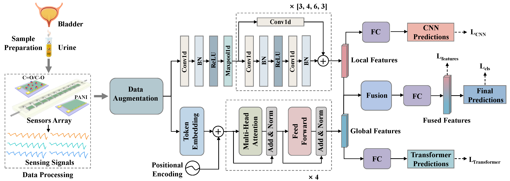

## Offical implementation of paper "TC-Sniffer: Fusing Transformers and CNNs for few-shot urinary bladder cancer diagnosis with class imbalance based on electronic noses"

### Abstract
Analyzing data from electronic noses (e-noses) using deep learning algorithms presents a promising non-invasive approach for the early detection of urinary bladder cancer (UBC), which is one of the most prevalent cancers of the urinary tract globally. However, the limited availability of clinical samples in real-world environments often impedes the performance of existing deep learning algorithms. The scarcity of clinical samples for certain classes, such as UBC and healthy individuals, presents two primary challenges: few-shot classification and class-imbalanced distribution. To address these issues, we propose a novel bi-branch framework for UBC diagnosis. Initially, intensity-based transformation techniques are employed to generate diverse samples for few-shot classes, thereby addressing the sample size issue and alleviating class imbalance during model training. Our bi-branch architecture, TC-Sniffer, integrates Transformers with temporal convolutional neural networks (CNNs) to capture long-range and short-range dependencies, facilitating robust representation learning. Furthermore, TC-Sniffer incorporates a feature-level constraint to learn distinct class-specific features, and employs a weighted classification loss to mitigate the effects of class imbalance. Additionally, we propose an efficient sensor selection algorithm that optimizes e-nose deployment by focusing on the most informative sensors, with a complexity of only $O(n)$. Experimental results on a self-collected dataset demonstrate that our proposed method significantly outperforms existing approaches, achieving a mean accuracy of 92.50\% in a 5-shot scenario.



### Results

|      Method       |       Accuracy        |       Precision       |        Recall         |       F1-Score        |        Average        |
| :---------------: | :-------------------: | :-------------------: | :-------------------: | :-------------------: | :-------------------: |
|        SVM        |   $0.8796\pm0.0039$   |   $0.8610\pm0.0060$   |   $0.8687\pm0.0022$   |   $0.8604\pm0.0042$   |   $0.8674\pm0.0041$   |
|        RF         |   $0.8518\pm0.0020$   |   $0.8277\pm0.0025$   |   $0.8619\pm0.0058$   |   $0.8332\pm0.0020$   |   $0.8417\pm0.0019$   |
|        KNN        |   $0.7928\pm0.0019$   |   $0.7943\pm0.0009$   |   $0.8203\pm0.0011$   |   $0.7748\pm0.0017$   |   $0.7955\pm0.0014$   |
|        GMM        |   $0.7870\pm0.0020$   |   $0.8044\pm0.0012$   |   $0.8102\pm0.0065$   |   $0.7822\pm0.0092$   |   $0.7959\pm0.0015$   |
|     ResNet-34     |   $0.8877\pm0.0020$   |   $0.8693\pm0.0043$   |   $0.8790\pm0.0011$   |   $0.8729\pm0.0029$   |   $0.8772\pm0.0025$   |
|    Transformer    |   $0.8796\pm0.0053$   |   $0.8651\pm0.0101$   |   $0.8549\pm0.0038$   |   $0.8577\pm0.0056$   |   $0.8644\pm0.0054$   |
|        MLP        |   $0.7669\pm0.0071$   |   $0.7418\pm0.0046$   |   $0.7425\pm0.0085$   |   $0.7385\pm0.0077$   |   $0.7373\pm0.0067$   |
|        RNN        |   $0.7951\pm0.0060$   |   $0.7807\pm0.0070$   |   $0.7779\pm0.0053$   |   $0.7728\pm0.0074$   |   $0.7816\pm0.0064$   |
|       LSTM        |   $0.8038\pm0.0092$   |   $0.7840\pm0.0136$   |   $0.7911\pm0.0038$   |   $0.7831\pm0.0077$   |   $0.7906\pm0.0084$   |
| TC-Sniffer (ours) | $\textbf{0.9250}\pm\textbf{0.0031}$ | $\textbf{0.9192}\pm\textbf{0.0060}$ | $\textbf{0.9076}\pm\textbf{0.0021}$ | $\textbf{0.9123}\pm\textbf{0.0032}$ | $\textbf{0.9160}\pm\textbf{0.0030}$ |


### Data preparation
Please contact corresponding authors: Weiwei Wu(wwwu@xidian.edu.cn) and Taoping Liu (liutaoping@xidian.edu.cn).


### How to run?
For deep learning models: 

training:
```python
python main.py --phase train
```
testing:
```python
python main.py --phase test
```

For machine learning models:

support vector machine (SVM)
```python
python machine_learning/svm.py
```
random forest (RF)
```python
python machine_learning/rf.py
```
k-nearest neighbors (KNN)
```python
python machine_learning/knn.py
```
Gaussian mixture model (GMM)
```python
python machine_learning/gmm.py
```

### Configs
For `configs/base.yaml`, three sub configurations need to be changed, *i.e.*, data_cfg, model_cfg, and loss_cfg. 

You can read the source file and change them correspondingly.

### Acknowledgement
We would thank [TSGM](https://github.com/AlexanderVNikitin/tsgm) for the effective data augmentations, [OpenGait](https://github.com/ShiqiYu/OpenGait) for the good Pytorch Template, and [liyiersan](https://github.com/liyiersan) for code implementation.


### Citation
If you find this repo useful or requst our data, please cite our papers:
```txt
@article{jian2022artificially,
  title={Artificially intelligent olfaction for fast and noninvasive diagnosis of bladder cancer from urine},
  author={Jian, Yingying and Zhang, Nan and Liu, Taoping and Zhu, Yujin and Wang, Di and Dong, Hao and Guo, Lihao and Qu, Danyao and Jiang, Xue and Du, Tao and others},
  journal={ACS sensors},
  volume={7},
  number={6},
  pages={1720--1731},
  year={2022},
  publisher={ACS Publications}
}


```


